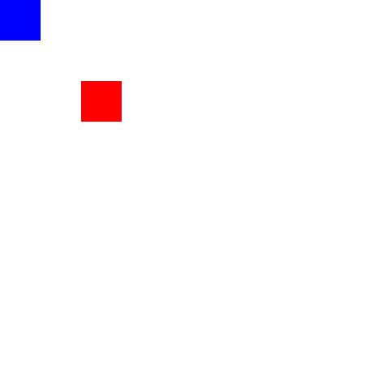
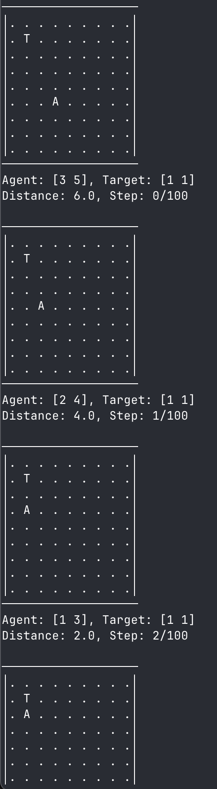

# GridWorld Reinforcement Learning Environment

A custom GridWorld environment implementation using Gymnasium, featuring PPO training with Stable-Baselines3.

## Overview

This project implements a discrete 2D grid environment where an agent learns to navigate from random starting positions to a target location. The environment supports both visual rendering modes and programmatic RGB array output for training visualization.



## Environment Details

### State Space
- **Observation**: Dictionary containing agent and target coordinates
- **Grid Size**: 9x9 (configurable)
- **Movement**: 8-directional (cardinal + diagonal)

### Action Space
- 8 discrete actions: Right, Up, Left, Down, Northeast, Northwest, Southeast, Southwest

### Reward Structure
- +1.0 for reaching the target
- -0.01 per step (encourages efficiency)

### Termination
- Episode ends when agent reaches target
- Maximum 100 steps per episode

## Rendering Modes

The environment supports two rendering modes:

### Human Mode
Text-based console output showing the grid state:



### RGB Array Mode
Returns numpy arrays suitable for creating visualizations, recordings, and feeding to vision-based RL algorithms.

## Project Structure

```
gridworld/
├── gridworld_tut.py      # Main environment implementation
├── gridworld_train.py    # PPO training script
├── gridworld_watch.py    # Evaluate trained agent
├── create_gif.py         # Generate training GIFs
├── model/                # Saved model checkpoints
└── log/                  # Training logs
```

## Usage

### Training
```bash
cd gridworld
python gridworld_train.py
```

### Watching Trained Agent
```bash
python gridworld_watch.py
```

### Creating Training GIFs
```bash
python create_gif.py
```

## Key Features

- **Gymnasium-compliant**: Follows standard RL environment interface
- **Vectorized Training**: Supports parallel environment execution
- **Multiple Render Modes**: Console display and RGB array output
- **Performance Optimized**: Pre-allocated grids and efficient coordinate transforms
- **Configurable**: Adjustable grid size and episode limits

## Dependencies

- gymnasium
- stable-baselines3
- numpy
- PIL (for GIF creation)

## Implementation Notes

The environment uses world coordinates (x, y) internally but converts to grid coordinates (row, col) for rendering. This separation allows for clean coordinate handling while maintaining intuitive movement directions.

The RGB array mode scales individual grid cells to 50x50 pixels for better visibility in generated visualizations, making the tiny 9x9 grid clearly visible in output media.